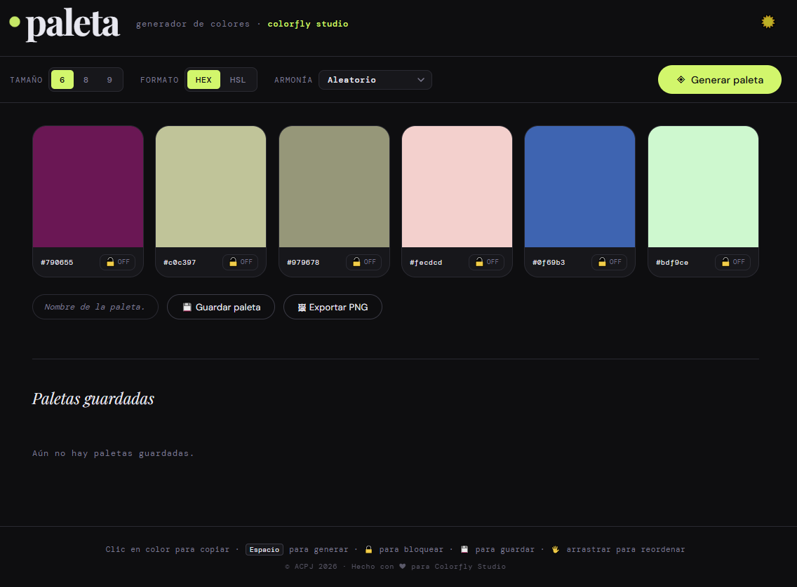

# Paleta · Generador de Colores para ColorFly Studio

Herramienta web para generar paletas de colores de forma rápida e intuitiva. Desarrollada para **Colorfly Studio**, agencia de branding que necesitaba estandarizar sus propuestas visuales.

**Características principales:**
- Generación de paletas entre 6, 8 o 9 colores
- Paletas con colores aleatorios o armónicos (análogos, complementarios, triádicos)
- Visualización en formato HEX y HSL
- Bloqueo, reordenamiento y guardado de colores
- Exportación como imagen PNG
- Diseño responsive con modo claro/oscuro

---

## Instrucciones de uso

### Instalación

1. Descargá el proyecto desde GitHub: botón verde **Code** → **Download ZIP**.
2. Descomprimí el archivo ZIP en la carpeta que quieras.
3. Abrí la carpeta y hacé doble clic en `index.html`. Se abre directamente en el navegador.
_No requiere instalación, servidores ni conexión a internet (salvo Google Fonts)._

Se vería así:

### Uso

Al abrir la app se genera una paleta automáticamente. Podés usar el botón **Generar paleta** o presionar <kbd>Espacio</kbd> / <kbd>G</kbd> para generar una nueva.

### Funcionalidades

| Funcionalidad | Descripción |
|---|---|
| Tamaño | Elegí entre 6, 8 o 9 colores |
| Armonía | Seleccioná desde un desplegable: Aleatorio, Análogos, Complementarios o Triádicos |
| Formato | Visualizá los códigos en HEX o HSL |
| Copiar | Clic sobre el color para copiar su HEX |
| Bloquear | 🔒 Fija colores para que no cambien al regenerar |
| Reordenar | Drag & drop para cambiar el orden |
| Guardar | 💾 Guarda paletas en el navegador con nombre editable |
| Exportar | 🖼 Descargá la paleta como PNG con nombre y marca de Colorfly Studio |
| Tema | ☀️ / 🌙 Modo claro u oscuro, se recuerda entre sesiones |

---

## Despliegue

Disponible en línea via GitHub Pages:
🔗 [https://acperezjulia.github.io/ProyectoM1_AnaliaPerezJulia/](https://acperezjulia.github.io/ProyectoM1_AnaliaPerezJulia/)

---

## Decisiones técnicas

- **Sin frameworks ni dependencias**: JavaScript vanilla para mantener el proyecto liviano, sin pasos de build y apto para abrirse como archivo local.
- **HSL internamente, HEX al copiar**: los colores se generan en HSL porque facilita el cálculo de armonías cromáticas. Al copiar se convierte a HEX, el formato estándar de los diseñadores de Colorfly Studio.
- **Mobile-first**: los estilos base están pensados para celular y escalan progresivamente con media queries.
- **localStorage**: las paletas guardadas y la preferencia de tema persisten en el navegador sin necesidad de backend.
- **Funcionalidades extra**: se incorporaron mejoras de UI/UX más allá de los requisitos base — drag & drop, exportación PNG, modos de armonía, barra de controles fija y modo claro/oscuro — para hacer la herramienta más útil en el uso real del cliente.

---

## Posibles mejoras

- Permitir ingresar un color propio como punto de partida de la paleta.
- Agregar más modos de armonía (tetrádicos, monocromáticos).
- Historial de paletas generadas (no solo las guardadas manualmente).
- Exportar la paleta como archivo .txt con todos los códigos HEX.

---

## Tecnologías

- HTML5 semántico con roles ARIA y etiquetas accesibles
- CSS3: variables, Flexbox, CSS Grid, diseño mobile-first, animaciones y transiciones
- JavaScript vanilla (sin frameworks ni dependencias)
- Canvas API para exportación de paletas como imagen PNG
- localStorage para persistencia de datos en el navegador
